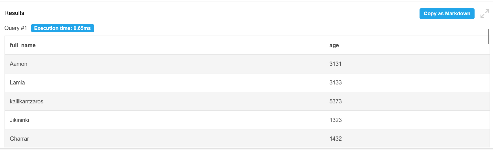
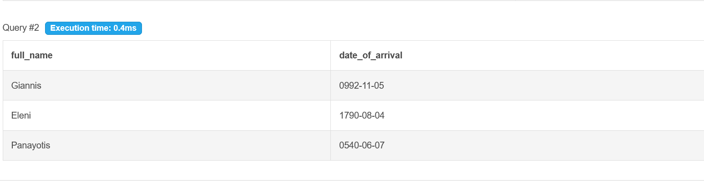
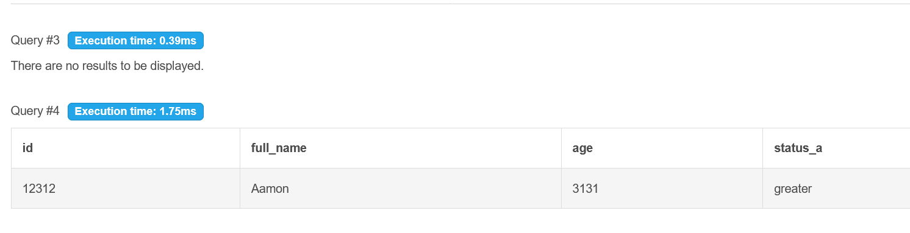
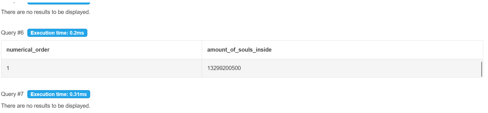
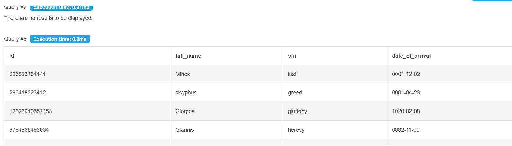
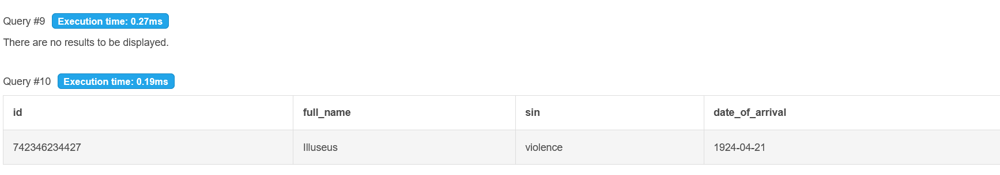

# Лабораторна Робота №3

виконав роботу Чорний Ігор з групи ІО-44

в цій роботі треба зробити декілька OLTP-запитів для перевірки себе та бази данних
# Цілі

◯ Написати запити SELECT для отримання даних (включаючи фільтрацію за допомогою WHERE та вибір певних стовпців).
◯ Практикувати використання операторів INSERT для додавання нових рядків до таблиць.
◯ Практикувати використання оператора UPDATE для зміни існуючих рядків (використовуючи SET та WHERE).
◯ Практикувати використання операторів DELETE для безпечного видалення рядків (за допомогою WHERE).
◯ Вивчити основні операції маніпулювання даними (DML) у PostgreSQL та спостерігати за їхнім впливом.

```
код під запити
-- 1. SELECT (Фільтрація демонів)
SELECT Full_name, Age 
FROM demon 
WHERE Status_a = 'lesser';

-- 2. SELECT (Фільтрація душ)
SELECT Full_name, Date_of_arrival 
FROM soul 
WHERE Sin = 'heresy';

-- 3. UPDATE (Зміна статусу демона)
UPDATE demon 
SET Status_a = 'greater' 
WHERE ID = 12312;

-- (тут результат)
SELECT * FROM demon WHERE ID = 12312;

-- 4. UPDATE (Зміна кількості душ на 1-му шарі)
UPDATE layer 
SET Amount_of_souls_inside = 13299200500 
WHERE Numerical_order = 1;

-- (тут результат)
SELECT * FROM layer WHERE Numerical_order = 1;

-- 5. DELETE (Видалення душі)
DELETE FROM soul 
WHERE ID = 54999491002345;

-- (аблиця всіх душ, щоб було видно що нема Maria)
SELECT * FROM soul;

--(тут insert про який я забув спочатку щоб додати нову душу)
INSERT INTO soul (ID, Full_name, Sin, Date_of_arrival) 
VALUES (742346234427, 'Illuseus', 'violence', '1924-04-21');

SELECT * FROM soul WHERE ID = 742346234427; 
```

і скріни результатів













# Висновок
в цій лабораторній я зрозумів як робити базові запити (та пофіксив свою таблицю ще з початку), довів все до стану де вона працює
(і так це сайт який мені сказав хтось використати, я скачав pgAdmin але я не знаю як поставити туда той сервер бо мені каже що там не той пароль а який пароль я не знаю, сподіваюсь за це не - бали)
