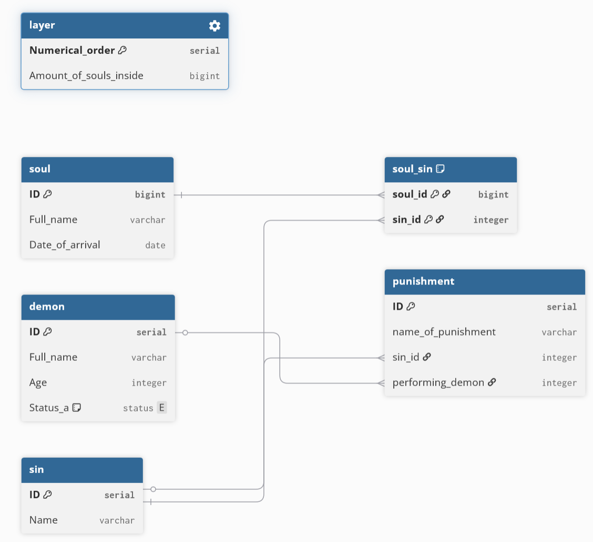

# Лабораторна Робота №5

виконав роботу Чорний Ігор з групи ІО-44

# Цілі

навчитись

◯Пошук надлишковості та аномалій: виявлення потенційної надлишковості даних (наприклад, повторювані значення) або аномалій оновлення (проблеми вставки/оновлення/видалення) у поточній схемі.

◯Перелік функціональних залежностей: визначте та перелічіть функціональні залежності (ФЗ) для кожної проблемної таблиці.

◯Перевірка нормальних форм: оцініть поточну нормальну форму кожної таблиці (1NF, 2NF, 3NF) на основі її функціональних залежностей (ФЗ) та структури ключа.

◯Застосування нормалізації: перетворення таблиць у вищі нормальні форми (до 3НФ) для усунення часткових та транзитивних залежностей.

# Виконання

з таблиці було видалено колонку Sin (гріх).

    Замість неї було створено нову таблицю зв’язку soul_sin.

у початковій схемі колонка Sin могла містити список гріхів (наприклад, «хіть, жадібність»), що порушує правило атомарності (одне поле — одне значення). Видалення цієї колонки та створення окремої таблиці зв’язку дозволяє кожній душі мати необмежену кількість гріхів без дублювання даних.

Усунення надмірності: Тепер назва гріха не пишеться текстом у кожному рядку з душею. Це економить місце та запобігає помилкам при введенні (наприклад, «Heresy» та «heresy» сприймалися б як різні гріхи).

    Створення таблиці Sin (Гріхи)

Що змінив: Додав абсолютно нову таблицю-довідник, яка містить лише унікальні назви гріхів та їхні ID.

Нашо: Це дозволяє централізувати дані. Гріх тепер є самостійною сутністю. Якщо потрібно змінити назву гріха або додати до нього опис, це робиться в одному місці (таблиця sin), а не в тисячах записів про душі чи покарання.

    Таблиця Punishment (Покарання)  

колонку required_sin (текстова назва гріха) замінив на sin_id (зовнішній ключ, що посилається на таблицю sin). Раніше покарання залежало від назви гріха, яка була просто текстом. Це створювало транзитивну залежність: ID покарання -> Назва гріха -> Властивості гріха. Тепер покарання прямо посилається на ID гріха. Зараз неможливо призначити покарання за гріх, якого не існує в таблиці sin. Система автоматично перевіряє цілісність посилань.

    Створення таблиці Soul_Sin

Додав проміжну таблицю, яка пов’язує ID душі та ID гріха. Тепер можна легко отримати список усіх гріхів конкретної душі або список усіх душ, що вчинили конкретний гріх, просто звернувшись до цієї таблиці.

код ALTER TABLE 

--  Створюємо нову таблицю для гріхів (3NF)
CREATE TABLE sin (
    ID SERIAL PRIMARY KEY,
    Name VARCHAR(32) UNIQUE NOT NULL
);

--  Створюємо проміжну таблицю для зв'язку душ і гріхів (1NF)
CREATE TABLE soul_sin (
    soul_id BIGINT REFERENCES soul(ID),
    sin_id INTEGER REFERENCES sin(ID),
    PRIMARY KEY (soul_id, sin_id)
);

-- Змінюємо таблицю soul: видаляємо неатомарне поле гріха
ALTER TABLE soul 
DROP COLUMN Sin;

-- Змінюємо таблицю punishment: 
-- Додаємо посилання на ID гріха (sin_id)
ALTER TABLE punishment 
ADD COLUMN sin_id INTEGER REFERENCES sin(ID);

-- Видаляємо стару текстову колонку гріха, яка створювала транзитивну залежність
ALTER TABLE punishment 
DROP COLUMN required_sin;

новий вигляд таблиці

# Висновок
